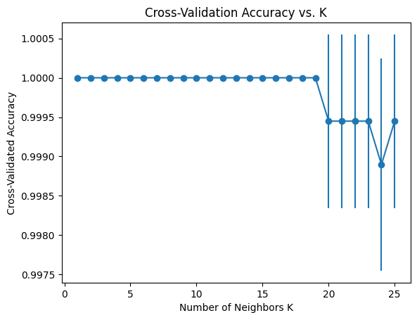

# Image Classification using CNN


## Table of Contents

- [Image Classification using CNN](#image-classification-using-cnn)
  - [Table of Contents](#table-of-contents)
  - [Introduction](#introduction)
  - [Advantages of Ensemble Learning](#advantages-of-ensemble-learning)
  - [Disadvantages of Ensemble Learning](#disadvantages-of-ensemble-learning)
- [Dataset 1](#dataset-1)
  - [Get to Know the Dataset](#get-to-know-the-dataset)
    - [Statistical Summary for each column](#statistical-summary-for-each-column)
      - [Label](#label)
      - [Feature 1](#feature-1)
      - [Feature 2](#feature-2)
- [Methods](#methods)
  - [Bagging](#bagging)
    - [Performance on the Dataset](#performance-on-the-dataset)
  - [Random Forest](#random-forest)
    - [Why are they different?](#why-are-they-different)
  - [Boosting](#boosting)
    - [AdaBoost with Early Stopping](#adaboost-with-early-stopping)
    - [Steps](#steps)
  - [KNN](#knn)
    - [Finding the Best k](#finding-the-best-k)
  - [Stacking](#stacking)
    - [Base models](#base-models)
    - [MetaModel](#metamodel)
    - [Model Evaluation](#model-evaluation)
- [Dataset 2](#dataset-2)
  - [Data Preprocessing Steps](#data-preprocessing-steps)
    - [1. Handle Missing Values](#1-handle-missing-values)
    - [2. Encode Categorical Variables](#2-encode-categorical-variables)
    - [3. Removing highly correlated features](#3-removing-highly-correlated-features)
  - [Bagging](#bagging-1)
    - [**Model Evaluation Metrics** (n\_estimators=50)](#model-evaluation-metrics-n_estimators50)
  - [Random Forest](#random-forest-1)
    - [**Model Evaluation Metrics** (n\_estimators=50)](#model-evaluation-metrics-n_estimators50-1)
  - [AdaBoost with Early Stopping](#adaboost-with-early-stopping-1)
    - [**Model Evaluation Metrics** (n\_estimators=5)](#model-evaluation-metrics-n_estimators5)
  - [KNN](#knn-1)
    - [Finding the Best k](#finding-the-best-k-1)
    - [**Model Evaluation Metrics** (K=21)](#model-evaluation-metrics-k21)
  - [Stacking](#stacking-1)
    - [Model Evaluation](#model-evaluation-1)
- [Contributors](#contributors)

## Introduction
Ensemble learning is a machine learning paradigm where multiple models, often referred to as "weak learners," are combined to solve a particular computational intelligence problem. The main principle behind ensemble methods is that by combining multiple models, the ensemble can achieve better performance than any single one of the models alone.

## Advantages of Ensemble Learning
- **Improved Accuracy**: By combining multiple models, ensembles can achieve higher accuracy and robustness than single models.
- **Reduced Overfitting**: Ensemble methods can reduce overfitting by averaging out biases and variances of the base models.
- **Versatility**: They can be applied to a wide range of machine learning tasks, including classification, regression, and anomaly detection.

## Disadvantages of Ensemble Learning
- **Increased Complexity**: Ensembles can be more complex to design, implement, and interpret compared to single models.
- **Longer Training Times**: Training multiple models can be time-consuming and computationally expensive.
- **Resource Intensive**: Ensembles typically require more memory and computational resources.
- 
# Dataset 1

## Get to Know the Dataset


### Statistical Summary for each column

#### Label

| Metric | Value  |
|--------|--------|
| Count  | 3031.0 |
| Mean   | 5.65   |
| Std    | 2.12   |
| Min    | 0.0    |
| 25%    | 5.0    |
| 50%    | 6.0    |
| 75%    | 7.0    |
| Max    | 8.0    |

#### Feature 1

| Metric | Value  |
|--------|--------|
| Count  | 3031.0 |
| Mean   | 359.70 |
| Std    | 198.92 |
| Min    | 7.80   |
| 25%    | 176.64 |
| 50%    | 350.35 |
| 75%    | 543.99 |
| Max    | 685.94 |

#### Feature 2

| Metric | Value  |
|--------|--------|
| Count  | 3031.0 |
| Mean   | 261.07 |
| Std    | 118.34 |
| Min    | 40.


# Methods
Ensemble methods can be divided into several categories based on how the base models are combined:

## Bagging
**introduction**
Bagging, or Bootstrap Aggregating, involves training multiple instances of the same algorithm on different subsets of the training data and averaging their predictions. The most famous example of bagging is the Random Forest algorithm.

<figure>
        
        <figcaption>Finding the best number of estimators</figcaption>
    </figure>

### Performance on the Dataset
<figure>
        
        <figcaption>Model visuallization on dataset</figcaption>
    </figure>

1. **Shallow Tree (max_depth=3):**
   The shallow tree learns simpler decision boundaries. It focuses on splitting the data into regions that are separated by only a few features. It might underfit if the dataset is complex but in our case, It generalizes well because of simpler datasets.

2. **Deep Tree (max_depth=None):**
  The deep tree creates intricate decision boundaries that closely fit the training data, potentially capturing noise and outliers.

3. **Less Aggressive Split (min_samples_split=4):**
   This tree creates boundaries where each split requires at least 4 samples, potentially leading to more generalized boundaries compared to smaller min_samples_split values.

4. **Entropy Criterion:**
   The entropy tree aims to find boundaries that reduce entropy (increase purity) at each split.

5. **Moderate Depth (max_depth=6):**
   This tree created somewhat complex boundaries, potentially capturing meaningful interactions in the data without overfitting to noise.

5. **Bagging Classifier with n_estimators=30:**
   Each tree in the ensemble (with bootstrap samples) will focus on different subsets of the data, averaging out individual idiosyncrasies and providing robust predictions.

## Random Forest
Random Forest belongs to the family of decision tree-based algorithms but extends their capabilities to improve predictive performance and reduce overfitting.
<figure>
        
        <figcaption>Finding the best number of estimators</figcaption>
    </figure>
<figure>
        
        <figcaption>Model visuallization on dataset</figcaption>
    </figure>

### Why are they different?
  **Bootstrap Sampling**: Each tree is trained on a random subset of the training data. This means that each tree sees a slightly different perspective of the data, capturing different patterns and relationships.<br>
  **Feature Subsampling**: Random forest uses feature sampling but in our case, Since there are only 2 features there is not much of a difference
## Boosting
Boosting involves sequentially training models, where each model attempts to correct the errors of the previous one. This is done by giving more weight to the instances that were misclassified by earlier models. Examples of boosting algorithms include AdaBoost, Gradient Boosting, and XGBoost.
### AdaBoost with Early Stopping
<figure>
        
        <figcaption>Finding the best number of estimators</figcaption>
    </figure>
<br>
We implemented AdaBoost in a way if there are no improvements within a certain number of increases in estimators, The algorithm stops and chooses the best n_estimator.


### Steps
<figure>
        
        <figcaption>Steps of Ada model</figcaption>
    </figure>
<br>

1. At first, when the model is weak and the weights are evenly distributed, it focuses on correctly classifying the most challenging examples in the dataset. This approach improves accuracy early on by addressing the most significant errors first.

2. In the next steps, each new learner is trained to correct the mistakes of their predecessors. In the early stages, as more weak learners are added, they contribute different perspectives and improve the model's ability to generalize across the dataset, leading to accuracy improvements.
3. in later iterations, the distribution shifts and new patterns emerge and the model struggles to adapt, leading to accuracy fluctuations.

## KNN
### Finding the Best k
The best k is found through experimentation and evaluation on a validation set.
```python
  for k in k_range:
    knn = KNeighborsClassifier(n_neighbors=k)
    scores = cross_val_score(knn, X_train, y_train, cv=cv, scoring='accuracy')
    mean_scores.append(np.mean(scores))
    std_scores.append(np.std(scores))

  best_k = k_range[np.argmax(mean_scores)]
```

<figure>
        
        <figcaption>Finding the best number of K</figcaption>
    </figure>

## Stacking
Stacking, or Stacked Generalization, involves training multiple base models and then using another model, the meta-learner, to combine their predictions. The meta-learner is trained on the outputs of the base learners to make the final prediction.
### Base models

```python
  base_models = [
  ('KNN', KNeighborsClassifier(n_neighbors=best_k)),
  ('rf', RandomForestClassifier(n_estimators=50)),
  ('Bagging', BaggingClassifier(base_estimator=DecisionTreeClassifier(), n_estimators=30, random_state=42)),
  ('AdaBoost',AdaBoostClassifier(base_estimator=base_estimator, n_estimators=30, random_state=42))
]
```

### MetaModel
```python
  meta_model = RandomForestClassifier(n_estimators=100, random_state=42)
```
### Model Evaluation
<figure>
        
        <figcaption>Model results on dataset 1</figcaption>
    </figure>

# Dataset 2

## Data Preprocessing Steps

Before building and training a machine learning model, it's essential to preprocess the data to ensure it is clean and suitable for analysis. The following steps outline the preprocessing procedures applied to the dataset.

### 1. Handle Missing Values

Missing values in the dataset can lead to inaccurate models and analyses. We used 2 ways to handle this matter:
  1. One common method to handle missing values is to drop any rows containing missing values.
  2. Using the K-Nearest Neighbors algorithm to impute missing values.

### 2. Encode Categorical Variables
Categorical variables need to be converted into a numerical format to be used in machine learning models. One-hot encoding creates binary columns for each category of the categorical variable.

### 3. Removing highly correlated features

<figure>
        
        <figcaption>Correlation Matrix</figcaption>
    </figure>

In this step, we find highly correlated pairs, and select one of them and remove them from the dataset. Assuming the threshold is 0.7 we can find multiple candidates to delete. The ones that we chose are **sysBP** and **CurrentSmoker**. Since sysBP is correlated to 2 columns and CurrentSmoker can be perceived from **CigsPerDay**.

`Code`
```python
for pair in high_corr_pairs:
  # Compare average correlations of the features in the pair
  avg_corr_1 = corr_matrix[pair[0]].mean()
  avg_corr_2 = corr_matrix[pair[1]].mean()
  
  # Drop the feature with higher average correlation
  if avg_corr_1 > avg_corr_2:
      to_drop.add(pair[0])
  else:
      to_drop.add(pair[1])

```

## Bagging

<figure>
        
        <figcaption>Finding the best number of estimators</figcaption>
    </figure>

### **Model Evaluation Metrics** (n_estimators=50)

| Metric     | Value |
|------------|-------|
| Accuracy   | 0.85  |
| Precision  | 0.80  |
| Recall     | 0.85  |
| F1 Score   | 0.81  |


## Random Forest

<figure>
        
        <figcaption>Finding the best number of estimators</figcaption>
    </figure>

### **Model Evaluation Metrics** (n_estimators=50)

| Metric     | Value |
|------------|-------|
| Accuracy   | 0.85  |
| Precision  | 0.80  |
| Recall     | 0.85  |
| F1 Score   | 0.80  |

## AdaBoost with Early Stopping
<figure>
        
        <figcaption>Finding the best number of estimators</figcaption>
    </figure>
<br>

### **Model Evaluation Metrics** (n_estimators=5)

| Metric     | Value |
|------------|-------|
| Accuracy   | 0.85  |
| Precision  | 0.77  |
| Recall     | 0.85  |
| F1 Score   | 0.79  |

## KNN
### Finding the Best k
<figure>
        
        <figcaption>Finding the best number of K</figcaption>
    </figure>

### **Model Evaluation Metrics** (K=21)

| Metric     | Value |
|------------|-------|
| Accuracy   | 0.85  |
| Precision  | 0.84  |
| Recall     | 0.51  |
| F1 Score   | 0.49  |

## Stacking

### Model Evaluation
<figure>
        
        <figcaption>Model results on dataset 2</figcaption>
    </figure>


# Contributors

This project was created and maintained by the following individuals:

- [Mohammad Mohamadian](https://github.com/MAMMAD1381)
- [MohammadReza MirRashid](https://github.com/mmdreza00mirrashid)
- 
[def]: #filters-1